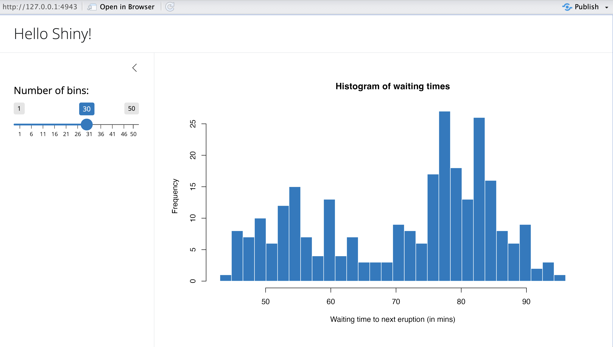

# R Shiny
Shiny is a fantastic R package that allows you to easily create interactive web applications (or "apps") directly from R. In this lesson, we’ll dive right into how to start building Shiny apps.

First things first, if you haven’t installed the Shiny package yet, simply open R, make sure you’re connected to the internet, and run the following command:
```
install.packages("shiny")
```
Shiny also integrates with another package called `bslib`, which helps in creating visually appealing user interfaces (UIs). To explore more about it, you can check out its documentation [here](https://rstudio.github.io/bslib/index.html?_gl=1*zs9lrr*_ga*MTE1OTUxODYwNi4xNzI0OTMzNDk1*_ga_8QJS108GF1*MTcyOTE0NzUzMi4yLjEuMTcyOTE0ODQ0MC4wLjAuMA..*_ga_2C0WZ1JHG0*MTcyOTE0NzUzMi43LjEuMTcyOTE0ODQ0MC4wLjAuMA..).

Here is an example of an R shiny app 


The Shiny package comes with several pre-built examples that showcase how Shiny works in action. Each example is a fully functional Shiny app.

The Hello Shiny example, for instance, generates a histogram using R’s *faithful* data set. The histogram’s bin count can be adjusted by the user through a slider, and the app instantly updates based on their selection. This example is perfect for learning the basics of Shiny app structure and building your very first app.

To try it out, just run the following commands in R:
```
library(shiny)
runExample("01_hello")
```

## Structure of a Shiny App
Shiny apps are typically organized in a single script called `app.R`, which resides in a designated folder (for example, `newdir/`). You can run the app by executing `runApp("newdir")`.

The `app.R` file consists of three main components:

1. A User Interface Object
2. A Server Function
3. A Call to the shinyApp Function

### User Interface(ui)
The user interface (ui) object defines the layout and visual aspects of your app. Below is the `ui` object used in the Hello Shiny example:
```{r}
library(shiny)
library(bslib)

# Define UI for app that draws a histogram ----
ui <- page_sidebar(
  # App title ----
  title = "Hello Shiny!",
  # Sidebar panel for inputs ----
  sidebar = sidebar(
    # Input: Slider for the number of bins ----
    sliderInput(
      inputId = "bins",
      label = "Number of bins:",
      min = 1,
      max = 50,
      value = 30
    )
  ),
  # Output: Histogram ----
  plotOutput(outputId = "distPlot")
)
```

### Server
Here i the server function for the Hello Shiny Example:
```{r}
# Define server logic required to draw a histogram ----
server <- function(input, output) {

  # Histogram of the Old Faithful Geyser Data ----
  # with requested number of bins
  # This expression that generates a histogram is wrapped in a call
  # to renderPlot to indicate that:
  #
  # 1. It is "reactive" and should automatically
  #    re-execute when inputs (input$bins) change
  # 2. Its output type is a plot
  output$distPlot <- renderPlot({
  
    x    <- faithful$waiting
    bins <- seq(min(x), max(x), length.out = input$bins + 1)

    hist(x, breaks = bins, col = "#007bc2", border = "white",
         xlab = "Waiting time to next eruption (in mins)",
         main = "Histogram of waiting times")
  })

}
```

At its core, the server function in the Hello Shiny example is quite straightforward. It performs some calculations and generates a histogram based on the specified number of bins.

However, you’ll notice that most of the script is wrapped in a call to `renderPlot`. The comment above the function provides some explanation, but don't worry if it seems unclear; we will explore this concept in greater detail later.

Before you start experimenting with the Hello Shiny app and reviewing its source code, remember that your `app.R` file should begin with loading the Shiny package and conclude with a call to `shinyApp`:
```
library(shiny)

# See above for the definitions of ui and server
ui <- ...

server <- ...

shinyApp(ui = ui, server = server)
```
While the Hello Shiny app is running, your R session will be occupied and won't accept other commands. R is actively monitoring the app and processing its reactions. To regain access to your R session, press the escape key or click the stop icon located in the upper right corner of the RStudio console panel.

How that you have known how to create an RShiny app, lets create a simple temperature converter that will convert temperature from Celcius to Farenheit. 

```{r results='hide'}
library(shiny)

# Define UI for the Temperature Converter app
ui <- fluidPage(
  titlePanel("Temperature Converter"),
  
  sidebarLayout(
    sidebarPanel(
      numericInput("temp_input", "Temperature:", value = 0),
      selectInput("temp_scale", "Select scale:", 
                  choices = c("Celsius to Fahrenheit", "Fahrenheit to Celsius")),
      actionButton("convert", "Convert")
    ),
    
    mainPanel(
      textOutput("result")
    )
  )
)

# Define server logic for the Temperature Converter
server <- function(input, output) {
  observeEvent(input$convert, {
    if (input$temp_scale == "Celsius to Fahrenheit") {
      result <- (input$temp_input * 9/5) + 32
      output$result <- renderText({ 
        paste(input$temp_input, "°C =", round(result, 2), "°F")
      })
    } else {
      result <- (input$temp_input - 32) * 5/9
      output$result <- renderText({ 
        paste(input$temp_input, "°F =", round(result, 2), "°C")
      })
    }
  })
}

# Run the app
shinyApp(ui = ui, server = server)
```

<span style="color: green;">**Practical Exercise**</span>

