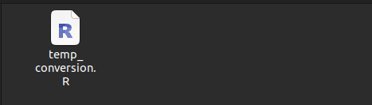
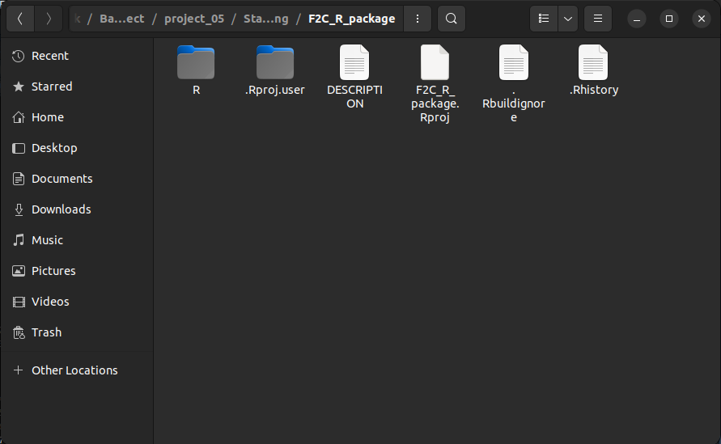

# Building R Packages

## Introduction 

In the second chapter we introduced about functions and we later talked about package functions, here we will now focus on how to build those packages. Packages are bundles of code and data to perform created by R users or community to perform a set of goven tasks. 

In this course you have encountered several packages like `dplyr`, `plyr` and `ggplot2` and might have installed one or many of them. Packages provide a ready-to-use functions and data sets that produce results faster without the need to write everything from scratch. Here we will discuss how you can create you own package in R. This will give you a deeper appreciation of the packages you rely on daily basis and how they are built. 

CRAN(The Comprehensive R Archive Network) and GitHub provide a repository where one can host and install packages to their local environments. 

In this guide, we will walk through how to create a package and host the packages either on GitHub or CRAN. 

## Prerequisites 

Before we jump in, there are a few packages you will want to have ready to help us along the way. We will install `devtools` and `roxygen2`. 

Install the packages
```
# Install devtools 
install.packages("devtools")

# Install roxygen
install.packages("roxygen2")
```

It might be necessary to restart R studio after installing the above packages 

## Building a simple R package

Here is where the fun begin! We will create a simple R package to serve you with the basics of building packages. The package will involve tow functions; 

i. A function to convert temperature from degrees Fahrenheit($^oF$) to degrees Celsius($^oC$). 
ii. A function to convert temperature from degrees Celsius($^oC$) to degrees Fahrenheit($^oF$).

**Step 1**

Create a folder that will hold the whole R package, in our case we will name the folder `F2C_R_package` like the one below.


**Step 2**

Currently this folder is empty, lets create another folder inside this `F2C_R_package` folder and name it `R`.


Here is where all the R scripts are stored. It can hold any amount of R files and each R file can hold any amount of R functions. You could example give each function each own file or insert more than function in a file. 

For large projects it is recommended to group similar functions in the same R file. 

**Step 3**

In our new R package, we will write both the two functions discussed above in the same file called, `temp_conversion.R` that has the code below;
```{r}
# Convert from Fahrenheit to Celsius
F_to_C <- function(F_temp){
  C_temp <- (F_temp -32) * 5/9
  return (C_temp)
}

# Convert from Celsius to Fahrenheit
C_to_F <- function(C_temp){
  F_temp <- (C_temp * 9/5) + 32
  return(F_temp)
}
```

That is the whole file for now, it has less than 15 lines of code. 



**Step 4** 

Next, create a file called `DESCRIPTION` in the `F2C_R_package` directory. This will be a plain text file with no extension and it will hold some of the metadata on the R package. In our case, it will hold the following lines of code specifying the package name, type, title and the version number. 
```
Package: F2CTempConverter
Type: Package
Title: Temperature Conversion Package for Demonstration
Version: 0.0.1.0
```

This is now a working R package and can be loaded by;
```{r warning=FALSE}
library(devtools);

load_all("F2C_R_package") # Load the directory path to where the package is

# Lets convert the temperature from Fahrenheit to Celsius
F_to_C(79)

# Converting from Celsius to Fahreinheit
C_to_F(20)
```

After this its good to add documentation to help users know what the function does. 

## Making A New R Project 

What we just did was an overview of how a package is created. Lets now explore how you can create a complete package with documentation. 

To do this go to `File > New Project ...` and the dialog box below should pop up. 


We will choose the `Existing Directory` option then `browse` to the `F2C_R_package` and click `Create Project` to create project from an existing directory. Now you should be able to see the project inside the package directory. 



## Adding Documentation 

Documentation helps others use the package that we have built, furthermore we can refer to the documentation to refer what we did after a long time. Documentation shows up in the `Help` tab of R Studio when running the function `help`. Just run the following in R studio to understand what I meant.
```
help(lm)
```

`?` does the same thing as `help`

```
?lm
```

You see there a tab that pops up with a documentation on `Linear Models`


**_____Add some more content______**

## Uploading and Installing from Github 

## Uploading and instaling it from CRAN

## More Info and Additonational Resources